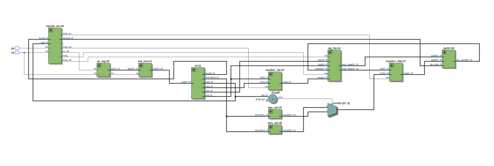
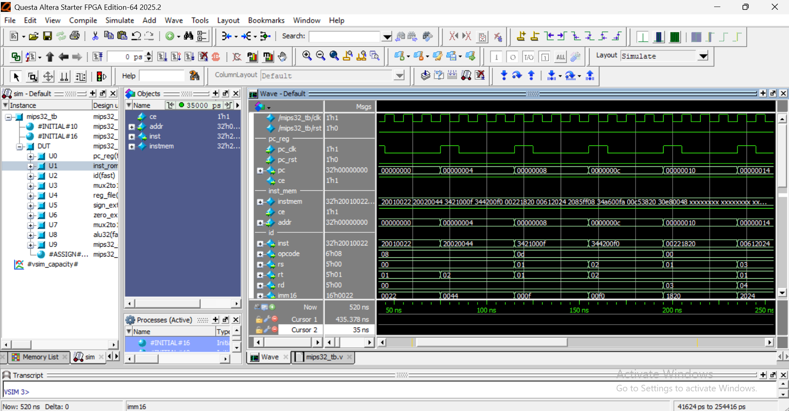
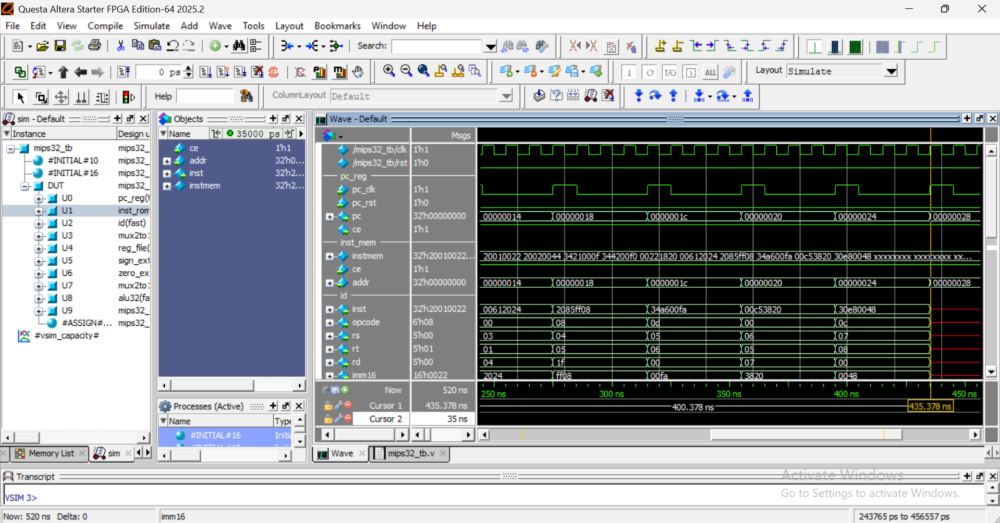

# MIPS32 Single-Cycle Processor

## Description
This project implements a 32-bit MIPS single-cycle processor using Verilog and developed in Quartus Prime.
## Supported Instructions 
R-Type
- ADD
- SUB
- AND
- OR
- XOR
  
I-Type
- ADDI
- ORI
- ANDI

## Architecture 
This processor is composed of the following core components:
- Program Counter(PC)
- Instruction Memory
- Instruction decoder 
- Control Unit
- Register File
- ALU(Arithmetic Logic Unit)
- Multiplexers

## RTL Viewer in Quartus Prime 

## 📸 Simulation Waveform

This waveform shows the PC incrementing by 4 at every rising edge of the clock, instructions being fetched from the instruction memory and the instruction being decoded into opcode, source/destination registers, and immediate values. 

